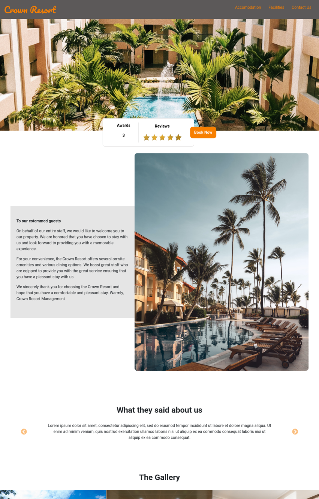

# international-frontend-hotel-1

#  Crown Resorts Website
This is a template for the Crown Resorts Hotel.

##  Deployment

The application was deployed to netlify.

##  Built With

*  HTML
*  CSS
*  JavaScript

##  Authors

* **Wendy Munyasi**  (https://github.com/wendymunyasi)
* **Lucas Gomez**  (https://github.com/gomezlucas)
* **Susan Wafula**  (https://github.com/Suzan97)
* **Florence Wanjiru**  (https://github.com/Machanga)
* **Esther Wavinya**  (https://github.com/es-debug)
* **Francine Madoh**  (https://github.com/FrancineMADOH)
* **Winnie Kiagie**  (https://github.com/kiagekwamboka)
* **Dolly Kpobi** 

##  License

This project is licensed under the MIT License.

## Project-Setup Instructions.

1. git clone using the following links.

   link: https://github.com/hngi/international-frontend-hotel-1.git

2. Naviagte to the `international-frontend-hotel-1` directory.
3. Open the file `index.html` to view the app on your browser.

## BDD

| Behaviour | Output |
| --------- | ------ |
|On loading the app you see the landing page with various photographs of the hotel. Clicking `Accomodation` link on the navigation bar.|You are redirected to a page where you view the accomodation details from the general amenities to various types of rooms.|
|Clicking `Facilities` link on the navigation bar.|You are redirected to a page where you view the various hotel facilities.|
|Clicking `Contact Us` link on the navigation bar.|You are redirected to a page written various ways you can use to contact us.|

## Sample Screenshot of a Part of the landing page

    

